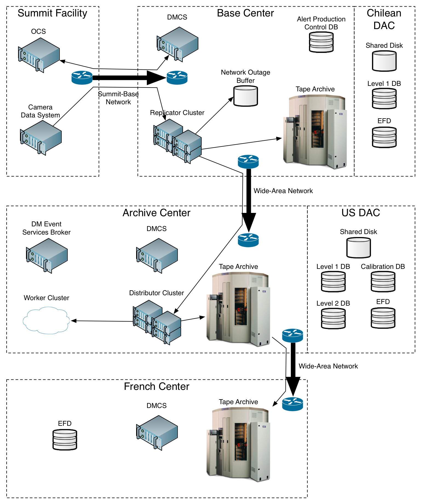
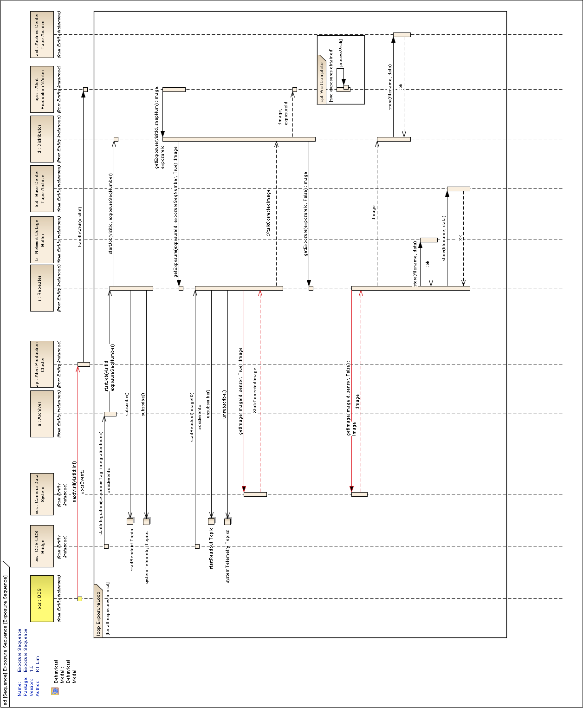

:tocdepth: 1

.. sectnum::

.. _intro:

Introduction
============

This document details the automated operations concept for the LSST Data
Management System (:term:`DMS`). It describes how the various components of the
application [#f1]_, middleware [#f2]_, and infrastructure [#f3]_ layers of
the :term:`DMS` work together to enable generation, storage, and access for the
Level 1, Level 2, and Level 3 data products [#f4]_). It specifies how
processing and data will flow from one component to another.

There are four major parts within the :term:`DMS`: the Alert Production
and its associated Archivers, the Calibration Products Production, the
Data Release Production (DRP), and the Data Access Center
(:term:`DAC`), which also provides facilities for Level 3 science
processing.

These four parts are implemented across four major centers located at
two sites: the Base Center and Chilean Data Access Center (:term:`DAC`)
located at the AURA compound in La Serena, Chile and the Archive Center
and US :term:`DAC` located at :term:`NCSA` in Urbana-Champaign,
Illinois, USA.  The DM system also communicates with the Camera and the
Observatory Control System located at the Summit Facility on Cerro
Pachón, Chile.

Note that many of these operations rely on the LSST Observatory Network
to transfer data and/or control information. The operations specific to
the network itself are not in the scope of this document; they are
covered in the LSST Network Operations and Management Plan
(Document-11918). This document presumes that the network is operating
normally except where specifically called out.

.. _alert-production:

Alert Production
================

The Alert Production's primary responsibilities are:

1. To archive all images from the Camera, including science images,
   wavefront sensor images, calibration frames, and engineering images,
   to tape archives at both the Base and Archive Centers,

2. To process these images to generate Level 1 data products, especially
   alerts indicating that something has changed on the sky and orbits
   for Solar System objects, and

3. To provide image quality feedback to the Observatory Control System
   (:term:`OCS`).

The science images include both crosstalk-corrected images that are used
for immediate Level 1 processing and raw, uncorrected images that are
permanently stored.

The Alert Production can be described from a “top-down” perspective,
starting with the “commandable entities”, which are software devices
that the :term:`OCS` can send commands to and receive status messages, events,
and telemetry from. It can also be described from a “bottom-up”
perspective starting with the physical machines used. Here, we start
with the top-down view, going into more detail on the machines and their
operations afterwards.

.. _fig-alert-prod-hardware:

   Alert Production Hardware

For context, here are the basic functions of some of the Data Management
(:term:`DM`) infrastructure components (see :ref:`fig-alert-prod-hardware`):

1. “Replicator” computers at the Base that receive images from the
   Camera and associated telemetry, transfer them to local storage, and
   send them over the wide-area network (WAN) to the distributor
   machines at the Archive.

2. A network outage buffer at the Base that retains a copy of each image
   in non-volatile storage for a limited time in case of WAN failure.

3. Tape archives at the Base and Archive that retain permanent copies of
   each image and other data products.

4. Shared disk storage for inputs and Level 1 data products at the
   Chilean and US DACs.

5. “Distributor” computers at the Archive that receive images and
   telemetry from the replicator machines and transfer them to local
   storage and the worker machines.

6. “Worker” computers at the Archive that perform the Alert Production
   computations.

7. Base and Archive DM Control Systems (:term:`DMCS`\s) running on one
   or more computers at each location that control and monitor all
   processing.

8. A DM Event Services Broker running on one or more computers at the
   Archive that mediates all DM Event Services messaging traffic.

9. A Calibration database at the US DAC that keeps information necessary
   to calibrate images.

10. Engineering and Facilities Database (:term:`EFD`) replicas at the
    Chilean and US DACs that store all observatory commands and
    telemetry.

11. The Level 1 database at the Chilean and US DACs that stores the
    Level 1 catalog data products.

12. The Level 2 database at the US DAC that stores measurements of
    astronomical Objects.

13. An Alert Production control database at the Base that maintains
    records of all data transfer and processing and is used by the Base
    :term:`DMCS`.

.. _alert-commandable-entities:

Base DMCS and OCS Commandable Entities
--------------------------------------

The Alert Production hardware is divided into four commandable entities
from the perspective of the :term:`OCS`:

1. Archiver: responsible for archiving images in real time.

2. Catch-Up Archiver: responsible for archiving images that did not get
   captured in real time due to an outage of some part of the DM system.

3. :term:`EFD` Replicator: responsible for replicating the :term:`EFD`
   from the Summit to the Chilean DAC and the US DAC.

4. Alert Production Cluster: responsible for generating Level 1 data
   products.

Each commandable entity can be commanded by the :term:`OCS` to
configure, enable, or disable itself, along with obeying other generic
:term:`OCS` commands such as ``init``, ``release``, ``stop``, and
``abort``. Each commandable entity publishes events and telemetry to the
:term:`OCS` for use by the observatory operations staff. The
command/action/response protocol used by the :term:`OCS` is common to
all subsystems and is a standard real-time system control mechanism
used, for example, by the ATST [#f5]_. The configure/enable/disable
message pattern is also a common one; it is used, for example, in the
LHCb control system [#f6]_.

All these commandable entities are implemented in the Base :term:`DMCS`.
They all run on a single machine, which is the only one that
communicates directly with the :term:`OCS`. If it fails, as detected by
heartbeat monitoring, it is powered down and a spare machine is enabled
at the same IP address, possibly missing one or more visits.

The Base :term:`DMCS` communicates with the :term:`OCS` via the Data
Distribution Service (DDS), through which it receives commands according
to a well-defined asynchronous command protocol [#f7]_ and sends command
result messages, status updates, events, and telemetry. It should be
noted that the commandable entities do their processing while in the
IDLE state from the perspective of the command protocol.

The Base :term:`DMCS` will be booted before the start of each night's
observing to ensure that the system is in a clean configuration. When
the Base :term:`DMCS` cold boots, the Base :term:`DMCS` performs a self
test sequence to verify that it can communicate with the DM Event
Services Broker (for DM-internal communications) and the :term:`OCS`
(via DDS).  After the self test sequence, the commandable entities start
up, in no particular defined configuration, and publish the OFFLINE
state to the :term:`OCS`.

The Base :term:`DMCS` uses the Orchestration Manager (currently
baselined to be implemented using HTCondor [#f8]_) to start jobs on the
replicators, distributors, and workers. The Orchestration Manager may
run on the Base :term:`DMCS` host or another machine.

The typical sequence of :term:`OCS` commands after a cold boot will be init,
configure, and enable for each commandable entity.

.. _init-command:

init command
~~~~~~~~~~~~

This instructs the :term:`OCS`-visible commandable entity controlled by
the Base :term:`DMCS` to move from an OFFLINE state to a normal
commandable IDLE state.  Successful completion requires that the Base
:term:`DMCS` ensure that :term:`OCS` global control is not locked out by
DM engineering (e.g.  software installation, diagnostic tests, etc.).

.. _configure-command:

configure command
~~~~~~~~~~~~~~~~~

This tells one of the :term:`OCS`-visible commandable entities controlled by the
Base :term:`DMCS` to establish or change its configuration. The
configuration includes the set of computers to be used, the software to
be executed on them, and parameters used to control that software. There
will be several standard configurations used during operations (although
each configuration will change with time); each such configuration can
be thought of as a mode of the corresponding DM commandable entities.
Some modes may apply to multiple commandable entities at the same time.
Changing modes (by reconfiguring the commandable entities) is expected
to take from seconds to possibly a few minutes; it is intended that mode
changes may occur at any time and multiple times during a night.

Besides normal science observing mode, available configurations will
include raw calibration image and engineering image modes for the
Archiver and Alert Production Cluster in which there are no visits and
different data products are generated. Another mode for the Alert
Production Cluster will be daytime DM operations (disconnected from the
camera), in which the Alert Production Cluster will be used to perform
solar system object orbit-fitting and various daily maintenance and
update tasks and the Archiver is disabled or offline.

First, the Base :term:`DMCS` verifies the command format and accepts the
command. Then it checks that the configuration is legal and consistent
and that various prerequisites are met. When the check is complete, the
commandable entity is disabled (see :ref:`disable-command`), the
configuration is installed, and success is returned to the :term:`OCS`. If the
configuration is illegal or cannot be installed properly, a command
error (non-fatal) with failure reason is sent instead.

All of the commandable entities' configurations include the version of
the software to be used. This version must have already been installed
on the participating machines. The presence of the necessary software
versions is checked by the Base :term:`DMCS` in the Alert Production
database (as maintained by system management tools).

The Archiver's configuration prerequisite is that sufficient
replicator/distributor pairs are available.

The Catch-Up Archiver's configuration prerequisite is that sufficient
catch-up-dedicated replicator/distributor pairs are available.

The Alert Production Cluster's prerequisites are that sufficient workers
are available.

The :term:`EFD` Replicator's prerequisite is that communication with the
US DAC :term:`EFD` replica is possible.

At the end of a configure command, the commandable entity is always
disabled.

.. _enable-command:

enable command
~~~~~~~~~~~~~~

This command enables the commandable entity to run and process events
and data. An enable command is rejected if no configuration has been
selected by a prior configure command to the commandable entity.

Enabling the Archiver causes the Base :term:`DMCS` to subscribe to the
“startIntegration” event.

Enabling the Catch-Up Archiver allows it to scan for unarchived images
to be handled and enables the Orchestration Manager to schedule image
archive jobs.

Enabling the Alert Production Cluster causes the Base :term:`DMCS` to
subscribe to the “nextVisit” event in normal science mode; another event
may be subscribed to in calibration or engineering mode.

Enabling the :term:`EFD` Replicator causes the Base :term:`DMCS` to
enable the US DAC :term:`EFD` replica to be a slave to the Chilean DAC
:term:`EFD` replica.

.. _disable-command:

disable command
~~~~~~~~~~~~~~~

This command disables the commandable entity from running and processing
news events and data.

Disabling the Archiver causes it to unsubscribe from the
“startIntegration” event. It does not terminate any replicator jobs
already executing.

Disabling the Catch-Up Archiver stops it from scanning for unarchived
images and tells the Orchestration Manager to stop scheduling any new
image archive jobs.

Disabling the Alert Production Cluster causes it to unsubscribe from the
“nextVisit” event. It does not terminate any worker jobs already
executing. In particular, the processing for the current visit (not just
exposure) will normally complete.

Disabling the :term:`EFD` Replicator causes the Base :term:`DMCS` to
disable the slave operation of the US DAC :term:`EFD` replica.

.. _release-command: 

release command
~~~~~~~~~~~~~~~

This is the equivalent of a disable command, but the commandable entity
goes to the OFFLINE state.

.. _stop-command:

stop command
~~~~~~~~~~~~

If issued during a configure command, this command causes the
commandable entity to go into the no configuration state.

If issued during any other command, this command is ignored.

.. _abort-command:

abort command
~~~~~~~~~~~~~

If issued during a configure command, this command causes the
commandable entity to go into the ERROR state with no configuration.

If issued at any other time, this command does nothing except change the
commandable entity to the ERROR state. In particular, an abort received
during enable will leave the system enabled and taking data, but in the
ERROR state from the command processing standpoint. Note that stopping
the processing of any commandable entity is handle by the disable
command, not the abort command.

.. _reset-command:

reset command
~~~~~~~~~~~~~

This command performs the equivalent of the disable command and leaves
the commandable entity in the IDLE state with no configuration.

In addition to the above commands, the Base :term:`DMCS` subscribes to
and responds to the following events published through the :term:`OCS`
DDS:

.. _start-integration-event:

startIntegration event
~~~~~~~~~~~~~~~~~~~~~~

Upon receipt of an startIntegration event, if the Archiver has been
enabled, the Base :term:`DMCS` launches replicator jobs. One job is
launched for each science raft (21) and one more job is launched to
handle wavefront sensor images. The middleware will preferentially
allocate these jobs to the pool of fully-operational replicators,
falling back to the pool of local-only replicators if more than two jobs
are assigned per fully-operational replicator. (See :ref:`replicator`
below for a more complete description of the replicator pools.)

If a replicator machine fails, the Orchestration Manager will
automatically reschedule its job on another replicator machine (or a
Catch-Up Archiver replicator).

The Base :term:`DMCS` will track the submission, execution, and results of all
replicator jobs using Orchestration Manager facilities and the Alert
Production control database.

.. _next-visit-event:

nextVisit event
~~~~~~~~~~~~~~~

Upon receipt of a nextVisit event, if the Alert Production Cluster has
been enabled, the Base :term:`DMCS` launches worker jobs. One job is
launched for each :term:`CCD` (189) and four more jobs are launched for
the wavefront sensors. These jobs are sent to the Orchestration Manager
for distribution to the worker machines.

If a worker machine fails, the Orchestration Manager will automatically
reschedule its job(s) on another worker machine (at lower priority, so
that it can be suspended or terminated if the machine is needed to
handle a current visit).

The Base :term:`DMCS` will track the submission, execution, and results
of all worker jobs using Orchestration Manager facilities and the Alert
Production control database.

.. _efd_replication:

EFD replication
---------------

Not included in the Alert Production per se but closely tied to it is
replication of the Engineering and Facility Database (:term:`EFD`) from
the Summit to the Chilean DAC and the Chilean DAC to the US DAC.

The replication is implemented by standard replication mechanisms for
the selected database management system used to implement the
:term:`EFD`. The latency for the replication from the Summit to the
Chilean DAC is anticipated to typically be in the milliseconds, although
latencies of up to one visit time are acceptable. The latency for the
replication from the Chilean DAC to the US DAC is to be as short as
possible, constrained by the available bandwidth from Chile to the US,
but no longer than 24 hours (except when a network outage occurs). The
typical case for Chile-to-US replication is expected to be seconds or
less.

The Alert Production computations will require telemetry stored in the
:term:`EFD`. The design does not rely on replication for this
information, however. At the Base, the local Chilean DAC :term:`EFD`
replica is queried for some information, but the :term:`OCS` telemetry
stream is also monitored for more recent changes than are reflected in
the results of the query. This essential data is then sent along with
the image data to the Archive for processing. If the replication proves
to have sufficiently low-latency and be sufficiently reliable, it will
be easy to switch to an alternate mode where the US DAC :term:`EFD`
replica is queried for the information of interest.

.. _fig-visit-sequence:

   Visit Sequence Diagram

.. _alert-production-hardware:

Alert Production Hardware
-------------------------

We now describe the detailed operations performed by each Alert
Production infrastructure component. The sequence of operations for a
typical visit is shown in Figure :ref:`fig-visit-sequence`.

All DM hardware is monitored by DM system administration tools, which
publish results via the Archive DM Control System. Each machine verifies
its software installation on boot (e.g. via hash or checksum).

.. _replicator:

Replicator
~~~~~~~~~~

The replicator's function is to receive raw and crosstalk-corrected
images from the Camera Data System (:term:`CDS`), transfer them to local
storage, and send them over the network to the distributors at the
Archive Center.

There are two pools of replicators maintained: one “fully-operational”
pool and one “local-only” pool of machines that are unable to connect to
their associated distributors. (In addition, the Catch-Up Archiver
maintains a separate pool of replicator machines; see
:ref:`catch-up-archiver`.)

When a replicator boots, it establishes a connection with a single,
pre-configured distributor (to avoid complex N-to-N connectivity). It
also checks its connection with the network outage buffer, the Base raw
image cache, and the tape archive. When all connections have tested
successfully, the replicator registers itself with the Orchestration
Manager in the fully-operational pool. If a connection to the
distributor cannot be made, perhaps because the distributor is down or
because the network is not operational, it registers itself in the
local-only pool.

Replicators execute replicator jobs. These are of two types: science
sensor jobs and wavefront sensor jobs. Both types of jobs perform
essentially the same tasks, just with different data. Science sensor
jobs deal with the 21 science rafts, each composed of 9 :term:`CCD`\s or
sensors.  Wavefront sensor jobs deal with the four wavefront sensors
located on the four corner rafts.

First, the job sends the visit id, exposure sequence number within the
visit, and raft id (for science sensor jobs) that it received from the
Base :term:`DMCS` to the replicator's connected distributor. It queries
the Base Engineering and Facility Database replica for information
needed to process the image. Subscriptions to the CCS startReadout event
and :term:`OCS` telemetry topics are made; the latter topics are
monitored for updates to key values, including a flag indicating whether
the system is taking science data. When the startReadout event occurs,
the image id information in the event is used to request retrieval of
the crosstalk-corrected exposure for the raft using the :term:`CDS`
client interface [#f9]_, blocking until it is available. When the
term:`CDS` delivers the image, its integrity is verified using a hash or
checksum, and the image and associated telemetry is sent over the
network to the distributor, compressing it if configured.
Simultaneously, the image is written to the network outage buffer and
the raw image cache using the Data Access Client Framework. The latter
two transfers are retried if necessary (up to a configured number of
retries). All images that are written are tagged with the Archiver mode.
After the crosstalk-corrected image has been sent, the raw exposure is
retrieved. That image is then sent over the network to the distributor
and simultaneously written to the network outage buffer and the tape
archive. All successful (and unsuccessful) image transmissions over the
network are recorded to the Alert Production database. (Successful
writes to the tape archive could also be recorded in the database for
convenience, although that poses the possibility of disagreement between
the database and the tape archive.)

(In some calibration or engineering modes, there may only be raw image
data, not crosstalk-corrected image data; the replicator job
configuration will provide for this.)

If data cannot be sent to the distributor, or if disconnection from the
distributor is detected by heartbeat ping at any other time, the
replicator unregisters from the fully-operational pool and registers in
the local-only pool. Similarly, if the connection is re-established in
the future, the replicator unregisters from the local-only pool and
re-registers in the fully-operational pool.

Writing to the tape archive system is obviously done in timewise order.
The tape archive itself uses its built-in disk caching capability to
reorganize writes to the tapes in a spatially localized manner to
maximize the ability to read back data for a single area of sky without
changing tapes.

Replicators are primarily constrained by their output bandwidth, not by
the number of cores. Each replicator job is assigned to one machine;
replicators normally execute only one job at a time. The pool of
replicators (and thus distributors, since they are paired) must
therefore be at least 21 + 1 machines, including one for each science
raft plus one for the wavefront sensors; 25 is suggested as a minimum to
provide hot spares for possible failures.

.. _distributor:

Distributor
~~~~~~~~~~~

The distributor's function is to receive raw and crosstalk-corrected
images from the replicator, transfer them to local storage, and
repackage them for the Alert Production Cluster workers.

When a distributor boots, it checks its connection with the network, the
Archive raw image cache, and the tape archive. When all connections have
tested successfully, the distributor waits for a connection from its
associated replicator.

Upon receipt of a visit id, exposure sequence number, and raft id from
the replicator, the distributor publishes them along with its network
address to the Archive :term:`DMCS`. Workers can connect to the
distributor to request a :term:`CCD`-sized crosstalk-corrected image.

When a distributor receives a crosstalk-corrected image and associated
telemetry from the replicator, it verifies its integrity using a hash or
checksum, writes it to the raw image cache using the Data Access Client
Framework, decompresses it if necessary, separates it into individual
:term:`CCD`-sized portions, and sends those portions to the appropriate
connected workers. When the distributor receives a raw image, it writes
it to the tape system. All images written are tagged with the Archiver
mode.

There is one distributor for each replicator.

.. _worker:

Worker
~~~~~~

The worker's function is to generate Level 1 data products from the
images.

When a worker boots, it checks its connection with the network, its
local scratch disk, the master calibration image storage, the
calibration database, the template image storage, the calibrated and
difference image cache, the Level 1 database, and the local alert
distribution point.

A worker job, which is written using the Pipeline Construction Toolkit,
is started with a visit id, the number of exposures to be taken, a
boresight pointing, a filter id, and a :term:`CCD` id. The job begins by
computing a spatial region that covers the expected area of the
:term:`CCD` plus a margin. It then retrieves the template image (by
filter and airmass), Objects (from the last Data Release),
:term:`DIAObject`\s, past :term:`DIASource`\s, and :term:`SSObject`\s
that overlap that region using the Data Access Client Framework. It also
retrieves the master calibration images appropriate for that :term:`CCD`
and filter.  Note that we have the time from the nextVisit event to the
completion of the first exposure of the visit, which is a minimum of 15
seconds, to start the worker job and perform this retrieval.

The job contacts the Archive :term:`DMCS` to determine the appropriate
distributor for the first image for the visit and raft. This is a
blocking call. When the distributor is known, the image is requested
from it, also via a blocking call. After that image, and associated
telemetry, has been retrieved and its integrity verified via hash or
checksum, instrument signature removal may be performed, if configured.
Succeeding images are requested in the same way, again by contacting the
Archive :term:`DMCS` and then the distributor. When the second image of
a pair is received, along with associated telemetry, it performs the
Alert Production processing to generate :term:`DIASource`\s, update
:term:`DIAObject`\s, and issue Alerts.

The Alert Production processing includes elements from the Single-Frame
Processing Pipelines, Association Pipelines, Alert Generation Pipeline,
Moving Object Pipelines, and Difference Imaging Pipeline. This includes
instrument signature removal (:term:`ISR`); :term:`CCD` assembly from
constituent amplifiers; cosmic ray removal and visit image combination;
image calibration (:term:`WCS`, :term:`PSF`, and background determination);
image differencing with the template; detection and measurement on the
difference image; forced photometry on the calibrated exposure at the
positions of the difference image detections; spatial association of
:term:`DIASource`\s with :term:`SSObject`\s (at positions interpolated
using pre-computed coefficients and the exact midpoint of the exposure)
and :term:`DIAObject`\s; creation of new :term:`DIAObject`\s for any
unassociated :term:`DIASource`\s; science data quality analysis (SDQA)
on all data products; and generation of Alerts for all relevant
:term:`DIASource`\s.

:term:`DIASource`\s, :term:`DIAObject`\s, and :term:`SSObject`\s are
updated (append-only) in the Level 1 database. Alerts are sent to the
local alert distribution point.  The calibrated and difference images
are written to their respective caches. All images written are tagged
with the Alert Production Cluster mode. The Data Access Client Framework
is used for all of this output.

Information from the image calibration and SDQA, including the
:term:`WCS` and information about the :term:`PSF`, is sent via the
:term:`DM` Event Services to the Base :term:`DMCS`, which then publishes
it via DDS as telemetry.

If the algorithms require communication of data between :term:`CCD`
jobs, either to determine global, focal-plane-wide values or to retrieve
certain data from neighboring :term:`CCD`\s, the DM Inter-Process
Messaging Services are used.  These services may be implemented using
two technologies, transparent to application code:

1. The jobs may communicate via the DM Event Services.

2. The jobs may be submitted as an HTCondor MPI universe job and then
may communicate via MPI.

In addition, the worker jobs themselves are likely to
(non-transparently) use thread-level parallelism to achieve sufficient
performance while processing the :term:`CCD`.

Since the worker jobs are expected to take longer than the inter-visit
time to run, two “strings” of worker machines are needed so that one
string is available for the current visit while the other is processing
the last visit. These strings are implemented as a double-sized pool of
worker machines. There need to be at least 193 workers per string, or
386 total workers. 400 workers are recommended to deal with failures,
slow processing, or other issues. Each worker executes on a set of cores
on one machine, typically 16 (one for each amplifier within the
:term:`CCD`).  Since we are anticipating at least 20 cores per processor
and two processors per machine for the pre-commissioning nodes, each
machine would have two workers (plus 8 extra cores for I/O and ancillary
tasks).  We thus require approximately 200 worker machines. While a pool
of dedicated Alert Production workers will be available, additional
machines from the Data Release Production cluster may also be used if
necessary.

If a worker job fails for a non-application reason (i.e. a failure that
is expected to be transient and non-replicable), the job is restarted
automatically by the Orchestration Manager on a spare machine. A
restarted job may need to obtain its data from the raw image cache
rather than a distributor.

As the Level 1 data products are generated at the Archive Center, they
are replicated to the US DAC and the Chilean DAC (over the WAN) via DM
File System Services and native replication for the Level 1 database.

.. _catch-up-archiver:

Catch-Up Archiver
-----------------

The Catch-Up Archiver transfers images from the camera that were not
retrieved due to an error or outage. It also transfers images from the
network outage buffer to the Archive Center.

The Catch-Up Archiver has its own replicators and distributors. These
nodes communicate similarly to the replicators and distributors of the
Archiver commandable entity.

The Base :term:`DMCS` scans the Camera buffer for images that have not been
archived to tape (or transmitted over the network). Each of those images
triggers a replicator job. The oldest images will be submitted first.
The Base :term:`DMCS` also scans the network outage buffer for images that were
not transmitted (as recorded in the Alert Production database). Those
images also trigger a different replicator job that retrieves its data
from the buffer instead of the camera.

Images handled by the Catch-Up Archiver are not processed by the normal
Alert Production Cluster. The Base :term:`DMCS` may be configured to
submit worker jobs to a separate pool of workers for catch-up processing
of these images.

.. _cal-eng-image-modes:

Calibration image and engineering image modes
---------------------------------------------

When the DM Archiver and Alert Production Cluster are configured in
these modes, there are no visits. The startExposure event is used to
trigger both replicator jobs and worker jobs (although another event
could be used to trigger the workers). Worker processing only performs
:term:`ISR` (often just a subset), :term:`CCD` assembly, :term:`PSF`
determination (if appropriate), and a subset of SDQA, as configured for
the mode selected.

.. _daytime-ops-mode:

Daytime DM operations mode
--------------------------

In this mode, the Alert Production Cluster is used to perform
:term:`SSObject` detection and orbit fitting (DayMOPS) and other
maintenance tasks, including updating :term:`DIAObject` and
:term:`DIASource` caches and projecting :term:`SSObject` orbits for the
next night. The Archiver may be enabled while the Alert Production
Cluster is in this mode, but no processing of any images will occur and
the distributors will never receive requests from the workers. The
Catch-Up Archiver may be enabled.

The Base :term`DMCS` will submit jobs to the Orchestration Manager as
necessary to perform the daytime tasks.

.. _failure-modes:

Failure Modes
-------------

In the event of a failure of the Summit-to-Base network link or Base
power and the consequent loss of :term:`DM` functionality, the Summit
has sufficient analysis capability to be able to proceed with
observations independently, writing images to the :term:`CDS` buffer.
The Catch-Up Archiver will then be used to retrieve and archive these
images when connectivity is restored. No alerts are produced, and no
feedback telemetry from :term:`DM` goes to the Camera or Telescope, of
course.

In the event of a total failure of the Base-to-Archive network link, the
replicators will detect loss of connection to the distributors, register
themselves into the local-only pool, and write to the local tape system
and the network outage buffer. The Network Operations team will be
notified to investigate and resolve the issue. The Catch-Up Archiver is
again used to retrieve and transmit these images to the Archive when
connectivity is restored. Again, no alerts are produced, and no feedback
telemetry goes from :term:`DM` to the Camera or Telescope. (If desired, spare
hardware at the Base such as the commissioning compute cluster could be
assigned to a worker pool to do a limited amount of processing to
provide feedback telemetry and even some alerts, but this is not part of
the baseline.)

In both network failure cases, if the outage is a “black swan” that
extends for longer than has been anticipated in the buffer sizes, media
shipping will be used as a backup image transfer channel. Images and
associated telemetry from an :term:`EFD` replica will be copied onto a
disk array (possibly solid state disk) at the Summit or Base, as
appropriate.  The array will then be shipped to the Base or Archive,
respectively (and then shipped back once the data has been extracted).
Multiple arrays will be required to handle expected shipping and data
transfer times.

In the event of a partial failure (e.g. a slowdown) of the
Base-to-Archive network link, the replicator jobs will detect that they
are not completing in the expected amount of time. As they detect this,
the replicator machines will re-register themselves in the local-only
pool. If sufficient pairs do so, the Network Operations team will be
notified to investigate and resolve the issue. After random time
intervals, as long as heartbeat messages from their paired distributors
continue to be received, the replicators will re-register themselves in
the fully-operational pool so as to enable automatic recovery.

For a more comprehensive discussion of network failures and network
operations, refer to the LSST Observatory Network Design (LSE-78) and
the LSST Network Operations and Management Plan (Document-11918).

If a replicator, distributor, or worker dies, a spare will be used
automatically by the Orchestration Manager. If the Base or Archive
:term`DMCS`, the DM Event Services Broker, or the Orchestration Manager
itself dies, a spare will be brought online. Since these machines
maintain little state, a replacement should be available rapidly without
missing many visits.

The network outage buffer is designed to be single-fault-tolerant. If
the tape system or shared disk become unavailable due to faults, the
Catch-Up Archiver can be used with the network outage buffer when they
return.

If an :term:`EFD` replica fails, queries can be directed to the next
master up the chain (US DAC to Chilean DAC, Chilean DAC to Summit) until
a new slave can be brought online and synchronized.

If the calibration, Level 1 catalog, or Alert Production control
database fails, a hot spare replica will be reconfigured to be the
master.

If the application software fails on a given sensor (or if the sensor
itself does not produce data or produces invalid data), the Alert
Production algorithms will be designed to continue processing in its
absence. Job failures of this type will be communicated to the
Orchestration Manager and will not be rescheduled.

If the Alert Production workers get behind, the Orchestration Manager
will begin to schedule worker jobs on spare worker hardware. If so
configured, it may also schedule jobs on the Data Release general
compute pool. The worker jobs themselves are designed to process batches
of DiaSources into Alerts so that at least some Alerts are issued for
each visit before the latency deadline. Executing jobs that are beyond
the deadline may be killed and scheduled for later reprocessing. If even
that is not enough and unexecuted jobs pile up because processing is too
slow, as determined by monitoring the Orchestration Manager's queue
length, the Base :term:`DMCS` will kill the oldest unexecuted jobs to
get below threshold. In addition, the Base :term:`DMCS` configuration
will allow sampling of visits for worst-case scenarios, in which only a
fraction of visits actually spawn worker jobs.

.. _maintenance-upgrades:

Maintenance and Upgrades
------------------------

New Alert Production software will be deployed during daytime
maintenance periods. Full integration tests of the new configuration on
both a dedicated integration cluster and the production hardware will be
performed before the software is certified to go live for science
observing. Each class of machine (e.g. replicator, distributor, worker,
:term:`DMCS`) will be uniform in terms of software, from the operating
system through the application code. Cluster configuration management
software like Chef or Puppet will be used to enable and ensure this.

The Alert Production compute load does not increase significantly with
time. (Only moving object prediction and association get noticeably
harder.) As a result, new hardware will be deployed primarily to replace
failed components and at specified hardware refresh intervals to avoid
obsolescence. Full integration tests of the production software on the
new hardware will be performed before science observing, with fallback
to the old hardware in case of difficulty. Since new hardware is
expected to have at least the same performance as old hardware,
heterogeneity of hardware within a machine class will be permitted. This
simplifies the upgrade process and avoids the need to change out many
machines at the same time.

.. _cal-prods-prod:

Calibration Products Production
===============================

The Calibration Products Production's primary responsibility is to
produce the master calibration images and calibration database needed to
perform instrument signature removal in the Alert Production and Data
Release Production. This includes computation of the crosstalk
correction matrix, which is then delivered to the Camera DAQ. It also
has a separate mode for use before the Data Release Production that
computes more detailed per-exposure calibration information based on
:term:`EFD` telemetry and auxiliary instrumentation (such as the
auxiliary telescope spectrograph). It runs periodically at the Archive
as needed depending on the measured stability of the Camera.

In its main mode, the production obtains recent raw calibration images
and associated telemetry from the raw image cache, including bias
frames, dark frames (if necessary), flat frames, and fringe frames (if
necessary) using the Data Access Client Framework. Although these images
need to be processed sequentially (so that biases can be removed from
flat frames, for example), these images can generally be processed on a
per-term:`CCD` (per-sensor) basis, allowing division into 189 (plus 4
for wavefront sensors) separate jobs. The Archive :term:`DMCS` submits
these jobs to the Orchestration Manager for execution on a portion of
the general Archive compute pool. Each job writes its resulting master
calibration images to the shared disk image storage at the US DAC using
the Data Access Client Framework and writes other information to the
calibration database at the US DAC. These master calibration images and
database records are then replicated to the Chilean DAC. It is not
expected that inter-process communication (i.e. inter-sensor data
movement) will be necessary to produce suitable master calibration
images at the :term:`ISR` level, though the architecture permits it.

Crosstalk correction matrix computations will initially proceed on a
per-:term:`CCD` basis as well, but it will require inter-process
communication.  This will be provided by the Inter-Process Messaging
Services.

In its pre-DRP mode, separate jobs will analyze the telemetry in the
:term:`EFD`, including auxiliary telescope spectra, to determine
detailed calibration models. These models include the system bandpass
function for every visit. This information will be written to the
calibration database at the US DAC and then replicated to the Chilean
DAC. Note that new versions of this information for every exposure will
be calculated each time; old versions will be maintained. These jobs
will be partitioned by time period, allowing parallelism for this
operation.

.. _drp:

Data Release Production
=======================

The Data Release Production's primary responsibility is to produce the
Level 2 data products for each Data Release, typically on an annual
basis although the first data release will process the first six months'
worth of data.

The Data Release Production operates autonomously and is not under the
control of the Observatory Control System. It is managed by the Archive
:term:`DMCS`, which submits jobs to the Orchestration Manager for
execution on the general Archive compute pool.

The Data Release Production is handled by the following infrastructure
components located at the Archive Center at :term:`NCSA` in Illinois:

1. Archive DM Control System

2. Tape archive

3. Shared scratch disk

4. Compute nodes

5. DM Event Services Broker

6. Shared disk for Level 2 data products at the US DAC

7. Level 2 database at the US DAC

8. Data Release Production (control) database

All :term:`DM` hardware is monitored by :term:`DM` system administration
tools, which publish results via the Archive DM Control System. Each
machine verifies its software installation on boot (e.g. via hash or
checksum).

.. _drp-overall-sequence:

Overall Sequence
----------------

Many of the Data Release Production algorithms are expected to involve
computations across the full set of available images, at least in one
region of the sky and possibly across the entire survey area. It is
impractical to perform these computations in an incremental fashion.
Therefore a “freeze date” must be chosen which delineates the latest
image to be included in the DRP processing.

After the freeze date is selected, the Calibration Products Production
is run in pre-DRP mode, which recalculates all of the master calibration
images and the calibration database to be used for all the exposures up
to that date.

Second, a region of the sky (about 5-10% of the total survey area) is
processed through the entire DRP, treating it as if that were the entire
survey. The results of this processing are analyzed and verified to
ensure that the software is performing properly.

Finally, after any software fixes or configuration changes resulting
from the single-region analysis, the entire sky is processed.

When the complete set of Level 2 data products has been generated, it is
transferred to the Chilean DAC (and any other non-project stand-alone
DACs that provide the necessary bandwidth resources). For the Chilean
DAC, this transfer nominally occurs by writing the data products to disk
and shipping the disk to Chile, although an alternative path via
high-speed network is being considered.

.. _drp-detailed-sequence:

Detailed Sequence
-----------------

The DRP computation can be considered to have several major segments:

1. Single-frame processing

2. Global astrometric and photometric calibration

3. Coaddition, template generation, and difference imaging

4. :term:`MOPS`

5. Object characterization and forced photometry

To initialize the DRP, Level 1 database visit metadata tables as of the
"freeze date" are copied to the DRP temporary database along with the
Calibration Database from the CPP and a verified “seed” Solar System
Object catalog. A dataset repository is configured pointing to the raw
images on tape and the master calibration images from the Calibration
Products Production, along with the DRP temporary database. The visit
metadata tables are scanned to extract the boresight RA/dec coordinates.
These are used to determine which sky tiles are covered by each visit.
The complete list of such sky tiles is gathered.

Then single-frame processing begins. The Archive :term:`DMCS` steps
through the list of sky tiles in sequence. Since the raw images on tape
are organized spatially, this allows tapes to be read sequentially. For
each sky tile in the list, the Archive :term:`DMCS` submits a list of
single-frame measurement tasks to the Orchestration Manager, one for
each visit overlapping that sky tile. Each task reads the raw visit
images from tape, performs instrument signature removal, characterizes
the image by determining its :term:`WCS`, :term:`PSF`, and approximate
photometric calibration, and detects and measures Sources on the image.
SDQA metrics are derived from these results. The image characterization
parameters and SDQA metrics are loaded into the DRP temporary database.
The Source datasets are retained in DRP scratch space. The calibrated
exposures are not retained, so all sky tiles can be processed as quickly
as possible.

The Archive :term:`DMCS` next submits tasks to the Orchestration Manager
to perform global astrometric and photometric calibration using the
Source datasets. The resulting astrometric and photometric models are
loaded into the DRP temporary database.

Source ingestion into the nascent Level 2 database can occur at this
point.

The Archive :term:`DMCS` then steps through the list of sky tiles again,
with the number of simultaneously processed tiles depending on available
scratch disk space. For each tile, the Archive :term:`DMCS` submits a
task graph with dependencies. The task graph generally alternates
between groups of tasks executed on a per-visit basis and groups of
tasks executed on a per-coadd-patch basis, with each group of tasks
depending (only) on the previous group. As each visit is
deterministically matched with a list of coadd patches it covers, the
entire task graph can be precomputed.

The first group of tasks regenerates calibrated exposures for each visit
overlapping a sky tile and writes the exposure images to DRP scratch
space. (This regeneration task is simplified to just instrument
signature removal because it can use the image characterization results
from the first pass.)

The second group of coadd tasks is issued for each coadd patch in the
sky tile. (Tiles are defined so that they align with coadd patches.)
Each such coadd task depends on the calibrated exposure regeneration
tasks for the exposures that overlap the patch. These tasks warp the
calibrated exposure to the patch frame using the astrometric models from
global astrometric calibration and then generate all coadds (deep,
short-period, best seeing, :term:`PSF`-matched, and template) from the warped
exposures. All coadd patches (except the templates) have detection and
measurement performed. The CoaddSource datasets, including footprints,
the deep coadd images, and the template images are retained in DRP
scratch space.

Another group of tasks is issued for each sky tile, again one per visit,
depending on the coadd tasks for the coadd patches covered by that
visit. These difference imaging tasks use the calibrated exposure for
the visit and the template images for the coadd patches to do image
differencing and DiaSource detection and measurement. Each DiaSource is
matched against known :term:`SSObject`\s. The DiaSource datasets and difference
images are retained in DRP scratch space.

A group of tasks, one per coadd patch, is used to spatially associate
DiaSources into DiaObjects.

Another group of tasks is executed to perform :term:`MOPS` on all
DiaObjects that have only one associated DiaSource. :term:`MOPS` is
expected to use a different data partitioning than the coadd patches.
The result of :term:`MOPS` is an updated list of :term:`SSObject` orbits
and a list of DiaObjects/DiaSources that were successfully linked.

The remaining unlinked DiaObjects (both single-DiaSource and
multiple-DiaSource) are loaded into the DRP temporary database.

A group of tasks, one per visit, is used to do forced photometry on
difference images at the positions of the DiaObjects in the database,
resulting in DiaForcedSources. The difference images are then removed
from the DRP scratch space.

DiaObjects, DiaSources, DiaForcedSources, and :term:`SSObject`\s can be ingested
into the nascent Level 2 database.

Finally, a group of tasks is executed, one per coadd patch, to associate
and deblend CoaddSources, Sources, and DiaObjects into Objects and then
perform MultiFit object characterization and forced photometry using the
calibrated exposures overlapping the patch, generating Object
measurements and ForcedSources.

Objects and ForcedSources are ingested into the Level 2 database at this
point.

The Level 2 catalogs are ingested into a temporary Level 2 database at
the Archive Center as portions are generated as described above, and the
metadata for the Level 2 image products is also ingested into the
database.

SDQA is performed continuously at each step as the Level 2 data products
are generated, with the resulting metrics ingested into the Level 2
database. Metrics from SDQA may be used in succeeding steps (e.g. to
avoid low-quality images during coaddition). Additional SDQA (automated
and manual) is performed after the data products are complete.

The Level 2 data products are sent to the Chilean DAC and installed
there. They are copied from Data Release Production scratch space and
the Data Release Production database to the US DAC.

The Level 2 database and images are then released simultaneously at the
US and Chilean DACs.

.. _drp-parallelization:

Parallelization
---------------

In order to accomplish the heavy computational load required by the Data
Release Production, parallelization across large numbers of cores is
required. Most pipelines are parallelizable over obvious data units such
as images, sky patches, or Objects. :term:`MOPS` is parallelizable over
lunation time periods. These data units will generate thousands to
millions or even billions of independent tasks, which will be grouped
into jobs of appropriate length, on the order of single-digit hours. In
particular, the object characterization may be done on all Objects
within a sky patch to minimize I/O of image pixels. These jobs will be
submitted to the Orchestration Manager.

The global astrometric and photometric calibrations involve solving
extremely large but sparse matrix algebra problems. Algorithms for doing
these computations are parallelizable but require message passing as
opposed to being independent tasks. These will be written using MPI as
wrapped within the Inter-Process Messaging Services.

The start, status, and result information (including timing) for each
job will be tracked by the Orchestration Manager and reported to the
Archive :term:`DMCS` for overall progress monitoring.

.. _drp-io:

Input and Output
----------------

As jobs built using the Pipeline Construction Toolkit execute, they
retrieve files from and persist files to tape, shared scratch disk, and
the in-progress Level 2 data products storage using the Data Access
Client Framework. They may also query the Data Release Production
database using that framework. Jobs do not write directly to the
database; instead, for efficiency and avoidance of transaction locking,
they write files that are ingested into the database at a later time.

All data products are backed up to tape as they are written to the data
products storage.

At the time of the data release, the in-progress data products are made
available to the DAC while the oldest data release (except DR1, which is
always kept) is removed.

.. _drp-failure-modes:

Failure Modes
-------------

Since the Data Release Production is composed of many restartable jobs,
hardware failures are typically handled by rescheduling on another node
from the general compute pool. The shared disk systems are designed to
be at least two-fault-tolerant (RAID 6).

If the application software fails on a given data element, which is
expected to be a rare occurrence due to the planned implementation of
automatic adaptive parameter configuration, the production can be
instructed to continue without those results or a manual execution of
the failed job with new configuration parameters can be performed. Such
parameters are recorded for provenance purposes.

.. _drp-maintenance-upgrades:

Maintenance and Upgrades
------------------------

New Data Release Production software will be frozen at or before the
data “freeze date”. While the software will have been tested on the
dedicated integration test cluster, the initial 5-10% region processing
also serves as a final verification pass on the production hardware.
Each class of machine (e.g. replicator, distributor, worker,
:term:`DMCS`) will be uniform in terms of application software, although
operating system and library versions may vary as long as results are
reproducible to scientific equivalence. Cluster configuration management
software like Chef or Puppet will be used to enable and ensure this.

New hardware will be deployed throughout the course of the survey to add
capacity, to replace failed components, and at specified hardware
refresh intervals to avoid obsolescence. New compute machines will be
tested as part of the development and integration clusters before
deployment in the operational compute cluster. Compute cluster machines
targeted for removal will be drained of jobs, de-registered from the
general compute pool, and then shut down. Disks will be handled
similarly, with logical volumes expanded across new disks and contracted
away from disks to be removed. In addition, there is downtime between
the completion of one :term:`DR` and the beginning of processing for the
next in which major upgrades, especially to central services like the
local area network, can be performed.

.. _dac:

Data Access Center
==================

The Data Access Center is composed of the following components:

1. Level 1 database

2. Engineering and Facilities Database replica

3. Daily Level 1 database snapshot

4. Query Services database for Level 2 catalogs

5. Calibration database

6. Raw image cache

7. Calibrated image cache

8. Difference image cache

9. Coadd and template image storage

10. Raw and master calibration image storage

11. Image regeneration service

12. Image cutout service

13. Level 3 database

14. Level 3 file storage

15. Level 3 compute cluster

Note that the tape archive system is considered part of the Archive
Center and not part of the US Data Access Center.

.. _dac-databases:

Databases
---------

The Level 1 database will be updated in an append-only fashion in real
time during observing as :term:`DIASource`\s and :term:`DIAObject`\s are
identified. It is intended to be queried for individual objects and
small cone searches, not for large statistical queries.

The Engineering and Facilities Database replica will also be updated
continuously in (near) real time.

At the beginning of the daytime :term:`DM` operations mode processing, the Level
1 database will be snapshotted to a static replica. This replica may be
used for statistical queries and analysis.

The Level 2 catalogs will be stored in a large-scale, parallel,
distributed database to provide sufficient performance for not only
full-table-scan queries but also near-neighbor queries.

The calibration database will be updated, in append-only fashion, at the
conclusion of each execution of the Calibration Products Production.

All databases provide SQL interfaces (possibly with extensions or
limitations) through standard (ODBC, mysqlapi, Python DB-API) APIs. In
addition, an ADQL adapter layer may be provided, as well as adapters to
produce FITS table or VOTable results. These adapters will be manifested
as Web services.

Bulk downloads of database information, including databases from older
Data Releases, will be provided in at least the same form as the tape
backups of each database, either through separate Web services or
through standard file transfer protocols (e.g. rsync, Globus Online).

.. _dac-image-storage:

Image Storage
-------------

Caches are maintained for raw, calibrated, and difference images, and
the full set of raw images is accessible from the tape system at the
Archive Center and the Base Center.

Recent coadd, template, and raw and master calibration images are stored
on disk. Historical versions are accessible from tape.

An image regeneration Web service is provided to produce calibrated and
difference images on demand. This service access the raw, master
calibration, and template images from the DAC disk or from tape as
required. Latency when tape is involved will obviously be greater.

The primary access to the image storage and regeneration service occurs
through the image cutout Web service. This takes a request with
appropriate parameters such as image type, date, spatial region on the
sky, sensor identification, etc. and retrieves the appropriate image(s),
trimming and mosaicking them as necessary. It can also be used to
retrieve stacks of images (“postage stamps”) of a particular object each
time it has been observed. The image cutout service has space dedicated
to it in each of the raw, calibrated, and difference image caches so
that multiple requests for the same area can be handled rapidly.

Additional bulk download interfaces, e.g. to Education and Public
Outreach, will be provided through separate Web services and standard
file transfer protocols.

.. _dac-level3-storage-compute:

Level 3 Storage and Compute
---------------------------

DAC users may be allocated database and file storage space for use by
their own, possibly proprietary, computations. At least part of the
database space will be distributed on the same nodes as the Level 2
query services database to facilitate joins with the large Object,
Source, and ForcedSource catalogs. Transfer of data to and from Level 3
file storage will be via standard file transfer protocols.

A compute cluster is provided for Level 3 usage. An Orchestration
Manager instance will control access to these nodes by pipelines written
using the Pipeline Construction Toolkit that use the Data Access Client
Framework for access to Level 1 and Level 2 data products. Level 3
pipelines may also use non-LSST-provided libraries, but only if that
code can be installed with ordinary user privileges.

Allocations of space and compute resources to users will be performed
according to project policy and enforced by resource management tools as
part of the storage infrastructure and Orchestration Manager.

A significant use case for Level 3 compute capacity is expected to be
processing of Data Release Production intermediate data products in a
way different than the DRP itself. This could involve producing
different coadds or different measurements, for example. This use case
will be enabled by copying the DRP intermediates to Level 3 file storage
as they are generated. Users may submit tasks and task graphs to the DAC
Orchestration Manager that have data dependencies on these
intermediates. The same facility that allows the Archive :term:`DMCS` to
sequence through the set of available visits or coadd patches can be
used to generate these task submissions. Note that the one-way nature of
the copy from DRP to Level 3 storage and the isolation of the Level 3
processes and compute hardware from the DRP hardware ensures that there
is no possibility for problems with user code in Level 3 to impact the
DRP. Also note that the Level 3 compute tasks are subject to the usual
resource management, and, in addition, the compute time available to
these tasks will be dependent on the amount of available Level 3 file
storage, since new intermediate data products will overwrite old ones
when the available space has filled up.

.. _dac-failure-modes:

Failure Modes
-------------

The smaller databases will be replicated to slave backups that can be
reconfigured as masters in the event of a failure.

The large Query Services database is designed to be at least
single-fault-tolerant [#f10]_, as is the shared disk used by the image
caches and storage.

The image regeneration and cutout services will be replicated across
multiple nodes in a standard load-balanced Web service configuration.

.. _dac-maintenance-upgrades:

Maintenance and Upgrades
------------------------

When new data releases are to be published, data is copied from the
Archive Center to the Data Access Center (either by local network,
wide-area network, or disk shipping). The data is incorporated into the
databases and image storage but not made accessible to external users.
Testing of the new release to verify completeness, consistency, and
accessibility is then performed. Finally, external user access is
enabled. Access to the third-oldest release (except the first) is then
disabled, and its space is reclaimed.

Level 1 database maintenance, including modifications to its schema,
will occur on the Archive Center copy during the day with replication to
the DAC copies during a daily maintenance period before the start of
nighttime observing. Level 2 databases in new data releases need not
have the same schema as in previous data releases. Further details on
database schema evolution are in the LSST Database Design document
(LDM-135).

When new versions of the DAC software services are to be deployed, they
will be brought up on the same hosts as the operational services, but
using different network ports. If the new versions require different
internal data formats, additional reserved space on the storage media
(tape, shared disk, local disk) will be used to hold the transformed
data. After the new services are tested, the old and new versions will
be swapped. Once the new version has been proved in operation, the old
service will be disabled and any space used will be reclaimed.

As for the Data Release Production, new hardware will be deployed
throughout the course of the survey to add capacity, to replace failed
components, and at specified hardware refresh intervals to avoid
obsolescence. Hardware for small databases will be brought up as slaves
and then, during a brief shutdown, converted to masters. Hardware for
the Query Services database will be brought up as additional replicas of
current data and then added to the database cluster. Query Services
database to be retired can just be shut down and removed. Web services
hardware can be deployed and retired as needed. Image storage will be
handled using logical volumes, expanding them across new disks and
contracting them away from disks to be removed.

Appendix: Abbreviations
=======================

.. glossary::

   CC-IN2P3
      IN2P3 Computing Center

   CCD
      charge-coupled device (sensor)

   CDS
      Camera Data System (also known as DAQ for data acquisition)

   DAC
      Data Access Center

   DAG
      directed acyclic graph

   DIA
      difference imaging analysis

   DIAObject
      DIA (variable) object

   DIASource
      DIA source (measurement of DIAObject)

   DM
      LSST Data Management

   DMCS
      DM Control System

   DMS
      Data Management System

   DR
      Data Release

   EFD
      Engineering and Facility Database

   IN2P3
      Institut national de physique nucléaire et de physique des
      particules

   ISR
      instrument signature removal

   LSST
      Large Synoptic Survey Telescope

   MOPS
      moving object processing system

   NCSA
      National Center for Supercomputing Applications

   OCS
      Observatory Control System

   PSF
      point-spread function

   SSObject
      solar system object

   WCS
      world coordinate system

.. _change-record:

Change Record
=============

+-------------+------------+----------------------------------+--------------+
| **Version** | **Date**   | **Description**                  | **Owner**    |
+=============+============+==================================+==============+
| 1.0         | 5/22/2013  | Initial Version                  | Kian-Tat Lim |
+-------------+------------+----------------------------------+--------------+
| 1.1         | 10/9/2013  | Updates resulting from Process   | Kian-Tat Lim |
|             |            | Control and Data Products        |              |
|             |            | Reviews                          |              |
+-------------+------------+----------------------------------+--------------+
| 1.2         | 10/10/2013 | TCT approved                     | R Allsman    |
+-------------+------------+----------------------------------+--------------+

.. rubric:: Footnotes

.. [#f1]
   Data Management Applications Design, LDM-151

.. [#f2]
   Data Management Middleware Design, LDM-152

.. [#f3]
   Data Management Infrastructure Design, LDM-129

.. [#f4]
   LSST Data Products Definition Document, LSE-163

.. [#f5]
   Hubbard, J.; Goodrich, B.; Wampler, S. Proc. SPIE 7740, 77402R
   (2010).

.. [#f6]
   http://accelconf.web.cern.ch/accelconf/icalepcs2011/talks/mobaust06\_talk.pdf,
   slide 8, DAQ Domain.

.. [#f7]
   Interface Control Document: LSST Observatory Control System
   Communication Architecture and Protocol, LSE-70; Interface Control
   Document: OCS-Data Management Software Communication Interface,
   LSE-72; and Interface Support Document: System Dictionary and
   Telemetry Streams, LSE-74.

.. [#f8]
   http://research.cs.wisc.edu/htcondor/

.. [#f9]
   Interface Control Document: Data Acquisition Interface between Data
   Management and Camera, LSE-68.

.. [#f10]
   LSST Database Design, LDM-135.
